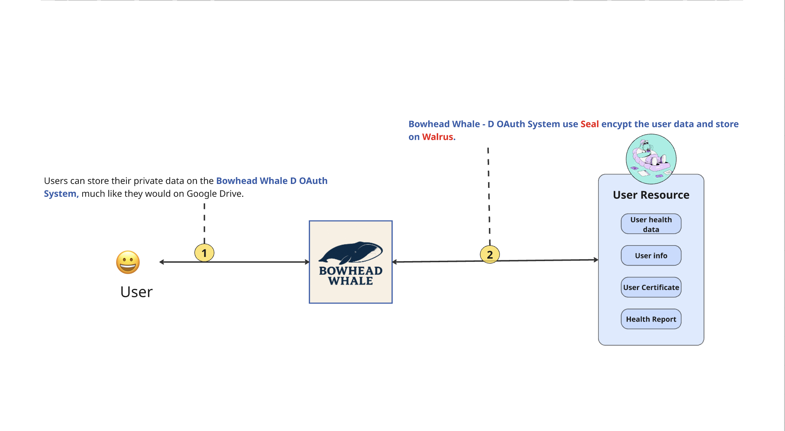
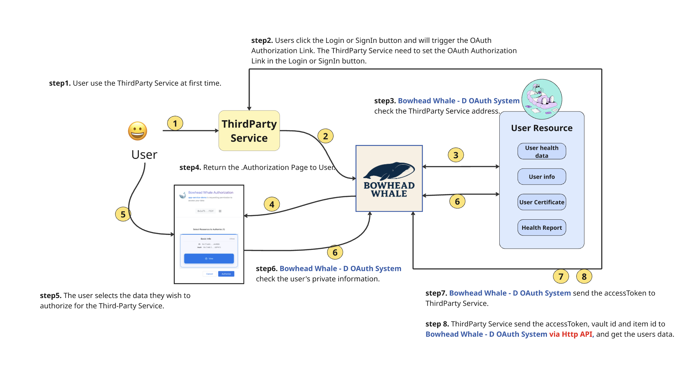

# Bowhead Whale - D OAuth

> Decentralized OAuth infrastructure based on Sui Move smart contracts, Walrus Blob storage, and Seal encryption protocol

## 📋 Project Overview

Bowhead Whale (also known as D OAuth) is a **decentralized OAuth infrastructure** that provides secure, decentralized user data management and authorization mechanisms for the Web3 ecosystem. By combining **Walrus Blob storage** and the **Seal encryption protocol**, it achieves fully decentralized user data management and third-party service authorization flows.

### 🌟 **Main Features**

1. 👤 **Regular Users :** Can store text, images, messages, and other data. All information is end-to-end encrypted via the Seal protocol and securely stored using Walrus decentralized storage.

2. **Third-party Services :** Must register with Bowhead Whale and obtain user authorization via OAuth to access user data. All data access is fully transparent and controllable.

## 📊 Workflows

### Path 1: ThirdParty Service Registration


```
Step 1: The ThirdParty Service want to use the user data, 
So register their service on the Bowhead Whale - D OAuth System.

Step 2: Bowhead Whale - D OAuth System will generate and display the OAuth Authorization Link. 
The Third-Party Service must save this link and trigger it when a user attempts to log in.
```

### Path 2: User D OAuth Login


```
Step 1: Users can store their private data on the Bowhead Whale D OAuth System, 
much like they would on Google Drive.

Step 2: Bowhead Whale - D OAuth System use Seal encypt the user data and store on Walrus.
```

### Path 3: Service Provider Accessing User Resources



```
Step 1: User use the ThirdParty Service at first time
        User → ThirdParty Service

Step 2: Users click the Login or SignIn button and will trigger the OAuth Authorization Link. 
        The ThirdParty Service need to set the OAuth Authorization Link in the Login or SignIn button.
        ThirdParty Service → Bowhead Whale - D OAuth System

Step 3: Bowhead Whale - D OAuth System check the ThirdParty Service address
        Bowhead Whale - D OAuth System → User Resource

Step 4: Return the Authorization Page to User
        Bowhead Whale - D OAuth System → Authorization Page → User

Step 5: The user selects the data they wish to authorize for the Third-Party Service
        User → Authorization Page (select resources)

Step 6: Bowhead Whale - D OAuth System check the user's private information
        Authorization Page → Bowhead Whale - D OAuth System → User Resource

Step 7: Bowhead Whale - D OAuth System send the accessToken to ThirdParty Service
        Bowhead Whale - D OAuth System → ThirdParty Service (accessToken)

Step 8: ThirdParty Service send the accessToken, vault id and item id to Bowhead Whale - D OAuth System 
        via Http API, and get the users data
        ThirdParty Service → Bowhead Whale - D OAuth System (accessToken, vault_id, item_id)
        → Return encrypted resource URL
        → Service provider decrypts using secret_key
```


## 🎯 Core Pain Points & Solutions

### **1️⃣ Centralized Dependency of Traditional OAuth → Decentralized OAuth Mechanism**

| Category | Pain Points | Solutions |
| --- | --- | --- |
| **End Users** | ❌ User data is controlled by centralized service providers, lacking autonomy | ✅ Users authorize through wallet signatures, gaining full control over their data<br>➡ Benefit: Users keep full ownership of their data without relying on third-party cloud services (e.g., Google Drive). |
| **Service Providers** | ❌ Traditional OAuth 2.0 relies on centralized authorization servers<br>❌ Single point of failure may cause service interruptions across all integrated services | ✅ Implement a fully decentralized authorization flow using Sui Move smart contracts<br>✅ No centralized servers required, reducing single point of failure risks |

---

### **2️⃣ Fragmented & Insecure User Data Management → Unified Data Management + End-to-End Encryption**

| Category | Pain Points | Solutions |
| --- | --- | --- |
| **End Users** | ❌ User data (images, videos, text, passwords) is scattered across multiple platforms<br>❌ Password managers and storage systems are separated, causing fragmented user experience | ✅ Unified management of all user data (images, videos, text, passwords)<br>✅ All data is encrypted on the client side before storage, accessible only to authorized parties |
| **Service Providers** | ❌ No unified encrypted storage solution | ✅ Integrates Walrus Blob Storage (decentralized storage) and Seal encryption protocol |

---

### **3️⃣ Lack of Trust When Third-Party Services Access User Data → Fine-Grained Authorization Control**

| Category | Pain Points | Solutions |
| --- | --- | --- |
| **End Users** | ❌ Users must provide sensitive data directly to third-party services | ✅ Users can selectively authorize access without exposing sensitive data |
| **Service Providers** | ❌ No fine-grained access control (read, edit, delete)<br>❌ Cannot track or revoke previously granted permissions | ✅ Supports fine-grained permissions: View, Edit, Delete<br>✅ All authorizations recorded on-chain, traceable and revocable<br>➡ Benefit: Third-party services can access authorized Walrus data using traditional HTTP APIs, reducing the learning cost of Walrus and Seal. |

---

### **4️⃣ Complex Onboarding for New Users → Automated Password Management**

| Category | Pain Points | Solutions |
| --- | --- | --- |
| **End Users** | ❌ Users must manually register before using third-party services | ✅ A password is automatically created on first login (auto-registration) |

## 🛠 Technical Architecture

### Core Technology Stack

- **Sui Move Smart Contracts** - Decentralized authorization logic and data structure management
- **Walrus Blob Storage** - Decentralized data storage infrastructure
- **Seal Encryption Protocol** - End-to-end encryption and access policy control
- **Wallet Signature Authentication** - User identity verification and authorization signatures

### Technical Implementation Highlights

1. **On-Chain Authorization Management**
   - `OAuthService` - Third-party service registration and whitelist management
   - `OAuthGrant` - User authorization records (includes resource types and expiration)
   - `check_policy` - Verifies if service is in whitelist

2. **Data Structure Design**
   - `DataVault` - Universal data vault (images, videos, text)
   - `KeyVault` - Password vault
   - `AccessEntry` - Time-limited access control entry

3. **Seal Encryption Integration**
   - Data encrypted and stored as Walrus Blob ID
   - Fine-grained access control through `seal_approve` method
   - Only authorized third-party services can decrypt corresponding resources

## 🚀 Core Features

### Feature Set 1: User Data Management

#### Feature 1: Universal Data Management
- Add, delete, modify data (images, videos, text) through Walrus
- Supports group management (Group Name)
- Fine-grained permission control (View/Edit/Delete)

#### Feature 2: Password Management
- Add, delete, modify passwords through Walrus
- Supports various password types (website passwords, bank passwords, etc.)
- Automated password synchronization and verification

### Feature Set 2: D OAuth Authorization Mechanism

#### Feature 1: Service Registration
- Third-party services register and obtain `clientId`
- Select requestable resource types
- Wallet private key authenticates service identity

#### Feature 2: OAuth Authorization Flow
- Users authorize third-party services through wallet signatures
- Selectively authorize specific resource types
- Supports time-limited access authorization

#### Feature 3: Automatic New User Registration
- Automatically creates passwords when first logging into third-party services
- Seamlessly integrated into OAuth flow
- Automatically synchronized to Bowhead Whale management interface

#### Feature 4: Quick Login for Existing Users
- Supports Common password mechanism
- Set once, use across multiple services
- Automatically validates user input


## 🔐 Security Features

- ✅ **End-to-End Encryption** - All data encrypted using Seal protocol
- ✅ **On-Chain Authorization Verification** - All authorization records on-chain, tamper-proof
- ✅ **Time-Limited Access** - Supports access expiration control
- ✅ **Fine-Grained Permissions** - Three-level permission control (View/Edit/Delete)
- ✅ **Whitelist Mechanism** - Only registered services can request authorization

## 📁 Contract Structure

- `seal_private_data.move` - Data vault and Seal encryption integration
- `oauth_service.move` - OAuth service registration and authorization management
- `utils.move` - Utility functions

## 🔗 Related Resources

- [Walrus Documentation](https://github.com/MystenLabs/awesome-walrus)
- [Seal Documentation](https://seal-docs.wal.app/)
- [Sui Move Documentation](https://docs.sui.io/build/move)

---

**Bowhead Whale** - Making Web3 user data management more secure, autonomous, and convenient
